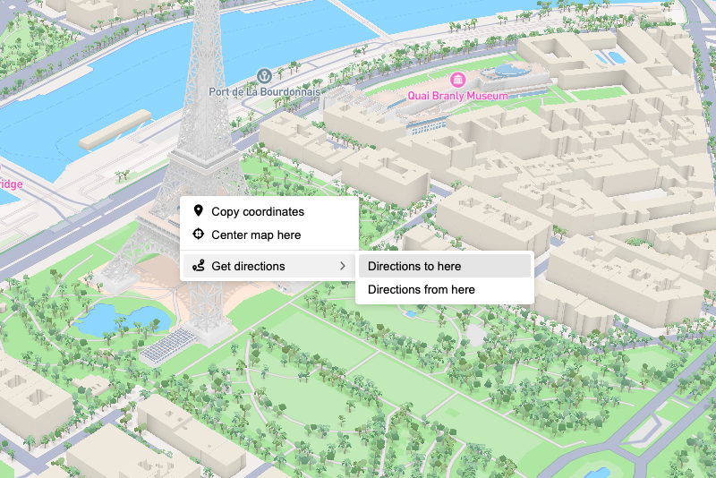

# mapbox-gl-contextmenu

A context menu plugin for Mapbox GL JS and MapLibre GL JS.

<p align="center">
  
</p>

## Installation

```bash
npm install mapbox-gl-contextmenu
```

## Usage

```ts
import mapboxgl from "mapbox-gl";
import { MapboxContextMenu, ContextMenuItem } from "mapbox-gl-contextmenu";

const map = new mapboxgl.Map({
  /* ... */
});

const menu = new MapboxContextMenu({ theme: "auto", width: 180 });

const centerItem = new ContextMenuItem({
  label: "Center map here",
  icon: "fa-solid fa-crosshairs"
});

centerItem.on("click", ({ map, lngLat }) => {
  map.flyTo({ center: [lngLat.lng, lngLat.lat] });
});

menu.addItem(centerItem);
menu.addTo(map);
```

## API

For complete API documentation, see the [API Reference](https://aratcliffe.github.io/mapbox-gl-contextmenu/).

### MapboxContextMenu

The main context menu class for Mapbox GL JS and MapLibre GL JS maps.

```ts
const menu = new MapboxContextMenu(options);
```

**Options:**

- `theme` - Theme to use: `'light'`, `'dark'`, or `'auto'` (follows system preference). Defaults to `'auto'`.
- `width` - Menu width as a CSS value (e.g., `'200px'`) or number in pixels.
- `className` - Custom CSS class name for the menu element.

**Methods:**

- `addItem(item)` - Add a menu item.
- `insertItem(index, item)` - Insert a menu item at a specific index.
- `removeItem(item)` - Remove a menu item.
- `addTo(map, layerIds?)` - Add the menu to a map. Optionally restrict to specific layer(s).
- `remove()` - Remove the menu from the map.

### ContextMenuItem

A clickable menu item with an optional icon.

```ts
const item = new ContextMenuItem({
  label: "Copy coordinates",
  icon: "fa-solid fa-copy"
});

item.on("click", ({ lngLat, map, point, features }) => {
  // Handle click
});
```

**Options:**

- `label` - A textual label to display.
- `icon` - CSS class name(s) for an icon font, or an `HTMLElement`.
- `iconPosition` - Position of the icon: `'before'` (default) or `'after'`.
- `disabled` - Whether the item is disabled. Defaults to `false`.
- `className` - Custom CSS class for the `<li>` element.
- `buttonClassName` - Custom CSS class for the `<button>` element.

**Properties:**

- `label` - Get/set the label text.
- `icon` - Get/set the icon.
- `disabled` - Get/set the disabled state.

**Events:**

- `click` - Fired when the item is clicked. Event data includes `lngLat`, `point`, `map`, `features`, and `originalEvent`.

### ContextMenuSubmenu

A menu item that displays a nested submenu on hover or click.

```ts
const submenu = new ContextMenuSubmenu({
  label: "More options",
  icon: "fa-solid fa-ellipsis"
});

submenu.addItem(new ContextMenuItem({ label: "Option A" }));
submenu.addItem(new ContextMenuItem({ label: "Option B" }));
```

**Options:**

- All `ContextMenuItem` options, plus:
- `showDelay` - Delay in ms before showing the submenu on hover. Defaults to `300`.
- `hideDelay` - Delay in ms before hiding the submenu when mouse leaves. Defaults to `200`.

**Methods:**

- `addItem(item)` - Add an item to the submenu.
- `insertItem(index, item)` - Insert an item at a specific index.
- `removeItem(item)` - Remove an item from the submenu.

### ContextMenuSeparator

A horizontal line for visually grouping menu items.

```ts
menu.addItem(new ContextMenuItem({ label: "Edit" }));
menu.addItem(new ContextMenuSeparator());
menu.addItem(new ContextMenuItem({ label: "Delete" }));
```

**Options:**

- `className` - Custom CSS class for the separator element.

## Keyboard Navigation

The menu supports full keyboard navigation:

- **Arrow Down/Up** - Move focus between items
- **Arrow Right** - Open a submenu when the submenu item is focused
- **Arrow Left** - Close submenu and return to parent
- **Enter/Space** - Activate the focused item
- **Escape** - Close the menu

## Theming

The menu supports light and dark themes via the `theme` option. Use `'auto'` to follow the user's system preference.

Custom styling can be applied via the `className` options on each component, or by overriding the CSS custom properties:

| Variable                               | Description            | Light Default                | Dark Default                |
| -------------------------------------- | ---------------------- | ---------------------------- | --------------------------- |
| `--context-menu-bg`                    | Menu background color  | `white`                      | `#141414`                   |
| `--context-menu-shadow`                | Menu box shadow        | `0 2px 8px rgba(0,0,0,0.15)` | `0 2px 8px rgba(0,0,0,0.3)` |
| `--context-menu-border-radius`         | Menu border radius     | `4px`                        | `4px`                       |
| `--context-menu-min-width`             | Menu minimum width     | `150px`                      | `150px`                     |
| `--context-menu-item-text-color`       | Item text color        | `black`                      | `white`                     |
| `--context-menu-item-hover-bg`         | Item hover background  | `#e8e8e8`                    | `#444444`                   |
| `--context-menu-item-active-bg`        | Active item background | `#f3f3f3`                    | `#2a2a2a`                   |
| `--context-menu-item-disabled-opacity` | Disabled item opacity  | `0.5`                        | `0.5`                       |
| `--context-menu-separator-color`       | Separator line color   | `#e8e8e8`                    | `#505050`                   |

## License

MIT
